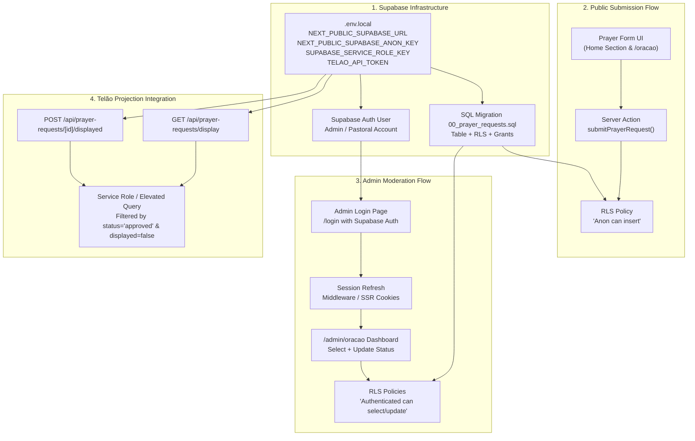

# Feature Landscape
**Domain:** Church Prayer Requests & Moderation
**Researched:** 2026-10-01

## Table Stakes

Features and behaviors that pastors, intercessors, and congregants consider foundational for an online church prayer request system.

| Feature | Why It's Expected | Church / Technical Nuance |
|---------|-------------------|---------------------------|
| **Frictionless Anonymous Submission** | Many seeking prayer face shame, trauma, or sensitive family/health crises. Forcing account creation destroys submission rates. | Public web form (`anon` role in Supabase) with explicit toggle for anonymity (`is_anonymous: boolean`). When anonymous, name is set to `null` or omitted from public view. |
| **Strict Gatekeeping & Moderation Lifecycle** | Unmoderated church submissions invite spam, trolling, personal phone/address leaks, or slander. Submissions must never be public immediately. | Default status is strictly `pending`. State transitions: `pending` ➔ `approved` or `rejected`. Only authenticated church leaders can see or transition requests. |
| **Spam & Abuse Protection** | Public forms without captchas or barriers become bot targets within days. | Multi-layered defense: (1) CSS-hidden honeypot field, (2) server-side input length limits and sanitization (stripping HTML/scripts), and (3) IP rate limiting (e.g., 3 requests/min). |
| **Privacy & LGPD Compliance** | Sensitive spiritual and health matters are sensitive personal data under Brazilian LGPD (Art. 5º, II - dados sensíveis). | Client IP must be anonymized/hashed before storage or rate-limiting (`SHA-256(ip + salt)`). Disclaimers on the form regarding how data will be used. |
| **Dedicated Admin Moderation Panel** | Pastors and prayer ministry leaders need an intuitive, mobile-friendly interface to triage requests before or during services. | Clean table/card view showing date, name (or "Anônimo"), truncated request with full text view, status badge, and clear action buttons ("Aprovar", "Rejeitar", "Desfazer"). Must be protected behind Supabase Auth session. |
| **Secure Projection/Display Integration API** | Churches project approved requests during the intercession moment of the Sunday service. | Machine-to-machine API endpoint (`GET /api/prayer-requests/display`) guarded by a shared secret (`Bearer TELAO_API_TOKEN`), returning only approved, un-displayed items in small batches (e.g., 10 items). |
| **Display State Tracking (`displayed: true`)** | Prevents projection systems from showing the same prayer requests repeatedly across consecutive service segments. | A post-projection hook (`POST /api/prayer-requests/[id]/displayed`) flags the record so subsequent polling queries only retrieve fresh approved prayers. |

---

## Differentiators

Features that elevate the experience from a generic CRUD contact form to a pastoral, human-centered ministry tool.

| Feature | Value Proposition | Implementation Pattern |
|---------|-------------------|------------------------|
| **"Desfazer" (Reversible Moderation)** | Prevents accidental rejections or approvals when triaging quickly on a smartphone before service starts. | Moderation UI maintains an action to revert any `approved` or `rejected` request back to `pending`. |
| **Dual-Identity Persistence (Privacy Shield)** | Allows the intercession team to know who asked privately without exposing their identity on public projection screens. | Database holds `name` and `is_anonymous`. In display API responses, `name` is explicitly coerced to `null` whenever `is_anonymous` is true, ensuring no leaks to third-party screen software. |
| **Graceful Offline / Mock Fallback** | Local development and testing can proceed without requiring an active Supabase cloud connection. | Server action and API endpoints detect absent Supabase environment variables and return mock responses for development/CI environments. |
| **Instant Toast / Acolhedor Feedback** | Submitting prayer is an emotional moment. The user needs immediate reassurance that their petition was received and will be prayed over. | Warm feedback message aligned with IBBE tone: *"Seu pedido foi recebido com carinho e nossa equipe de intercessão estará orando por você."* |
| **Realtime Service Updates (Supabase Realtime)** | Moderator dashboard updates dynamically as new requests roll in during a live worship service without requiring manual page refreshes. | Supabase postgres changes channel subscription (`supabase.channel('prayer_requests')`) on `/admin/oracao`. |

---

## Anti-Features

Things to consciously avoid because they create pastoral hazards, privacy violations, or unnecessary complexity for a local community church.

| Anti-Feature | Why to Avoid | Alternative / Preferred Approach |
|--------------|--------------|----------------------------------|
| **Public Unmoderated Prayer Wall** | Creates severe vulnerability to hate speech, pranks, spam, or marital/family gossip broadcast to the whole internet. | Strict moderator approval required before any request can be queried by display APIs or seen outside the admin panel. |
| **Mandatory User Registration / Login for Submitters** | Creates high cognitive friction and deters visitors or people in crisis from reaching out for prayer. | Anonymous/public form with rate limiting and honeypot. Only the moderation panel requires Supabase Auth. |
| **Public Voting / "I Prayed" Counters on Website** | Can gamify spirituality, create vanity metrics, or discourage people whose requests receive fewer clicks. | Internal ministry dedication: requests are brought to the pastoral team and altar without public popularity counters. |
| **Raw IP Logging in Postgres** | Violates Brazilian LGPD guidelines on sensitive data and digital privacy for church members. | If rate limiting is logged, store only salted `SHA-256` hashes, or maintain ephemeral in-memory rate-limiting maps with automatic TTL cleanup. |
| **Complex Multi-Step Pastoral Workflow (Ticketing System)** | Enterprise helpdesk patterns (tickets, SLA tracking, multi-tier escalation) overwhelm volunteer church staff and pastors. | Clean single-screen triage: `Pendente` ➔ `Aprovado` / `Rejeitado`, with single-click actions and filter tabs. |
| **Exposing Direct Supabase Queries from Projection Telão** | If client projection software queried Supabase directly using public anon keys, RLS would either have to expose all prayers publicly or fail. | Decoupled server-side Route Handlers (`/api/prayer-requests/display`) validating a dedicated `TELAO_API_TOKEN` and executing with elevated server privileges. |

---

## Feature Dependencies

Understanding the sequence of technical dependencies required to activate and verify the real Supabase integration.



### Critical Architectural Observations

1. **Authentication Gate for `/admin/oracao`**:
   The admin page currently executes:
   ```ts
   const { data: { user } } = await supabase.auth.getUser();
   if (!user) redirect("/login");
   ```
   However, `/app/login` currently has no `page.tsx`! To test and verify the moderation flow end-to-end with real Supabase Auth, a lightweight `/login` page (or simple email/password form) must exist to authenticate the pastor/admin.

2. **Display Route Handler Authorization & RLS**:
   `GET /api/prayer-requests/display` is a machine-to-machine route called by church presentation software with `Authorization: Bearer <TELAO_API_TOKEN>`. Because this request carries no user session cookie:
   - Calling `createClient()` (anon key) will trigger RLS `Authenticated can select prayer requests`, returning an empty list or permission denial because the caller is anonymous.
   - **Resolution:** The display API routes must use a Supabase client initialized with `SUPABASE_SERVICE_ROLE_KEY` (or an admin client helper) to query approved requests server-side after successfully verifying `TELAO_API_TOKEN`.

3. **Status Enum Alignment**:
   In `00_prayer_requests.sql`, `status check (status in ('pending', 'approved', 'rejected'))` and `displayed boolean default false not null`.
   - Admin UI sets status to `approved`, `rejected`, or `pending`.
   - Display API queries `status = 'approved' AND displayed = false`.
   - Displayed API marks `displayed: true`.
   This two-dimensional flag (`status` + `displayed`) cleanly separates human moderation from presentation playback state.

---

## MVP Recommendation

For Milestone v1.1 ("Configuração do Supabase e Pedidos de Oração"), the focus is verifying and connecting existing UIs to a real Supabase instance.

### Must Have (Milestone v1.1 Verification Scope)
1. **Supabase Project & Migration Deployment**:
   - Run `00_prayer_requests.sql` on the live Supabase project.
   - Verify table structure, default values (`status = 'pending'`, `displayed = false`), RLS enabled.
2. **Environment Configuration**:
   - Set valid `.env.local` keys: `NEXT_PUBLIC_SUPABASE_URL`, `NEXT_PUBLIC_SUPABASE_ANON_KEY`, `SUPABASE_SERVICE_ROLE_KEY`, `TELAO_API_TOKEN`.
3. **Public Submission Verification**:
   - Submit a prayer request from the landing page with name.
   - Submit an anonymous prayer request (`is_anonymous: true`).
   - Confirm records appear in Supabase with `status: 'pending'`.
4. **Admin Authentication & Moderation Flow**:
   - Provision initial admin user via Supabase Auth.
   - Implement minimum viable `/login` screen so the moderator can log in.
   - Verify listing, approving, rejecting, and undoing status in `/admin/oracao`.
5. **Display API Verification**:
   - Verify `GET /api/prayer-requests/display` returns HTTP 401 without Bearer token.
   - Verify with valid Bearer token returns only approved, un-displayed requests.
   - Verify `POST /api/prayer-requests/[id]/displayed` updates `displayed: true` and removes it from subsequent GET queries.

### Deferred (Post-v1.1 / Future Enhancements)
- **Email/Push Notifications to Intercession Team**: Having Supabase send transactional emails or WhatsApp notifications when a new prayer arrives (can be added via Supabase Edge Function or Database Webhook if volume warrants).
- **Dedicated Telão Webapp**: A standalone full-screen web presentation tool (slide carousel) that polls the display API.
- **Categorization / Prayer Tags**: Tagging requests by category (Saúde, Família, Gratidão, Conversão).

---

## Sources

- [Supabase Row Level Security Documentation](https://supabase.com/docs/guides/database/postgres/row-level-security)
- [Next.js Server Actions & Route Handlers Security](https://nextjs.org/docs/app/building-your-application/data-fetching/server-actions-and-mutations#security)
- [Lei Geral de Proteção de Dados (LGPD - Lei 13.709/2018), Art. 5º e 11º sobre dados sensíveis](https://www.planalto.gov.br/ccivil_03/_ato2015-2018/2018/lei/l13709.htm)
- Project files: `PROJECT.md`, `supabase/migrations/00_prayer_requests.sql`, `app/actions/prayer.ts`, `app/admin/oracao/page.tsx`, `docs/telao-api.md`.
